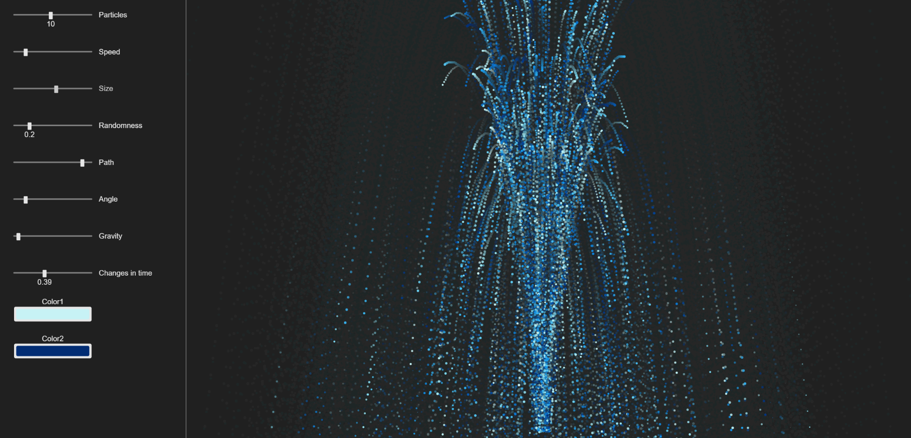

# js-fountain_drawing
This is a small example on how to draw fountains using particles I built using <a href="https://p5js.org/">p5.js</a>.
## URL
This proyect is hosted by github pages at <a href="https://pabloqb2000.github.io/js-fountain_drawing/">this link</a>.
## Options
  - Particles: number of particles spawned in each frame
  - Speed: initial speed of each particle
  - Size: mean size of the particles
  - Randomness: ammount of randomness to apply to both the thickness and the speed
  - Path: length of the path of each particle
  - Angle: maximum angle at wich the particles are shoot
  - Gravity: ammoutn of gravity applied to the particles
  - Changes in time: how much the initial speed of the particles varies in time
  - Color1, color 2: the colors of the particles are choosen between these 2 colors
## Notes
#### The path
The path of the particles is created by drawing a background with an alpha channel in each frame, this gives an ilusion as if the particles had a path.
#### The changes in time
The changes in time are made using a perlin noise wich determines how much the particle should vary its velocity.
## Screenshot
</img>
## References
To find more information about the <b>awesome</b> library used for this proyect visit:
<a href="https://p5js.org/"> https://p5js.org/ </a>

## Other proyects
Checkout my other proyects at <a href="https://pabloqb2000.github.io/Math_visualization/">Click math</a>